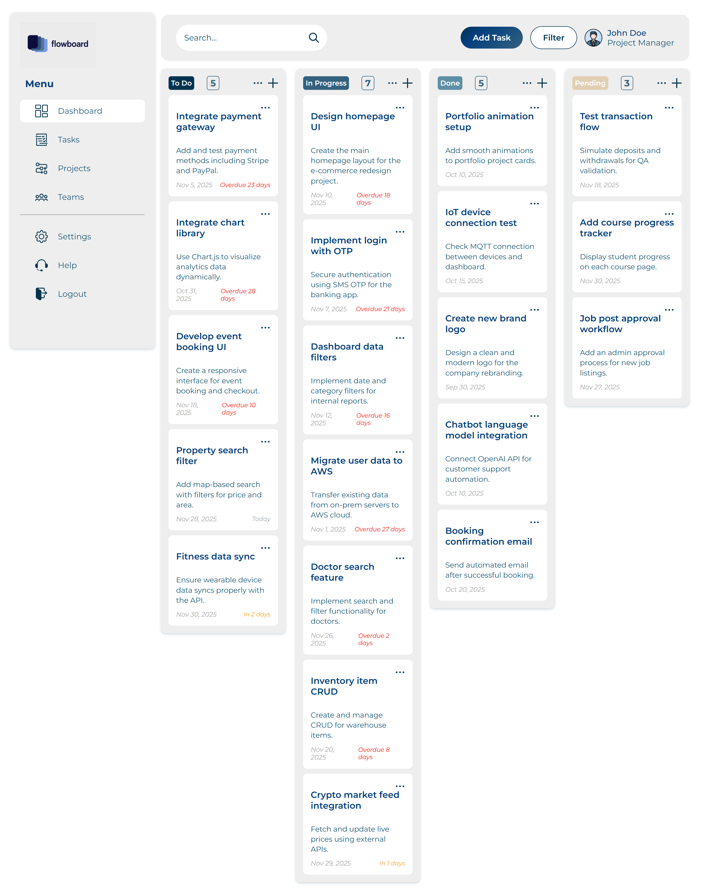

# flowBoard - Tableau de bord de gestion de projets

[flowBoard Logo](assets/images/logo.jpg)

## Aperçu

flowBoard est un outil moderne et responsive de gestion de projets développé en HTML, CSS et JavaScript pur. Il permet aux équipes de planifier, organiser et suivre leurs projets de manière efficace grâce à un tableau de bord clair, un board Kanban pour les tâches, et des sections dédiées aux projets et à l’équipe.

Parfait pour les petites équipes ou les indépendants qui recherchent une alternative légère à Trello, Asana ou Monday.com.

## Fonctionnalités

- Tableau de bord avec statistiques animées (projets totaux, terminés, en cours, en attente)  
- Board Kanban (À faire / En cours / Terminé / En attente) avec glisser-déposer  
- Ajout/édition/suppression de tâches via des modals élégantes  
- Visualisation du progrès des projets (graphique en jauge)  
- Suivi du temps (chronomètre intégré)  
- Rappels et notifications  
- Gestion des projets (liste + ajout via modal)  
- Profil équipe avec photos, poste, email et téléphone  
- Recherche globale  
- Design 100 % responsive (menu hamburger sur mobile)  
- Persistance des données via localStorage  
- Aucun framework ou bibliothèque externe (vanilla JS + Canvas pour les graphiques)

## Captures d’écran

### Tableau de bord
[Dashboard](assets/screenshots/dashboard.png)

### Board des tâches



## Technologies utilisées

- HTML5  
- CSS3 (Flexbox, Grid, variables CSS, animations)  
- JavaScript vanilla (ES6+)  
- Google Fonts : Montserrat & Poppins  
- Icônes et images personnalisées  
- Graphiques réalisés avec Canvas HTML5 (sans Chart.js)  
- Données initiales : fichiers JSON (`projects.json`, `tasks.json`, `team.json`)

## Installation

1. Clonez ou téléchargez le projet :
   ```bash
   git clone https://github.com/votre-pseudo/flowboard.git
   ```

2. Allez dans le dossier :
   ```bash
   cd flowboard
   ```

3. Ouvrez simplement `index.html` dans votre navigateur.

Aucun serveur ni dépendance n’est requis. Pour développer confortablement, utilisez une extension comme **Live Server** (VS Code).

## Utilisation

- Le tableau de bord s’affiche par défaut avec les statistiques chargées depuis les JSON ou localStorage.  
- Utilisez le menu latéral pour naviguer (Dashboard · Tâches · Projets · Équipe).  
- Sur mobile, cliquez sur le menu hamburger.  
- Ajoutez des tâches depuis le bouton principal ou via le « + » dans chaque colonne.  
- Glissez-déposez les cartes pour changer leur statut.  
- Le chronomètre dans la carte « Time Tracking » vous permet de suivre le temps passé.

### Réinitialiser les données
Effacez le localStorage de votre navigateur pour revenir aux données d’origine des fichiers JSON.

## Structure du projet

```
flowboard/
├── assets/
│   ├── icons/          # Icônes de l’interface
│   └── images/         # Logo, avatars, etc.
│   └── screenshots/    # Screenshots
├── data/
│   ├── projects.json   # Données projets
│   ├── tasks.json      # Données tâches
│   └── team.json       # Membres de l’équipe
├── index.html          # Page principale
├── styles.css          # Styles complets
├── script.js           # Toute la logique JavaScript
└── README.md           # Ce fichier
```

## Contribution

Les contributions sont les bienvenues !

1. Forkez le projet  
2. Créez une branche (`git checkout -b feature/ma-fonctionnalite`)  
3. Commitez vos modifications (`git commit -m 'Ajout de ma fonctionnalité'`)  
4. Poussez la branche (`git push origin feature/ma-fonctionnalite`)  
5. Ouvrez une Pull Request

Pour les grosses modifications, ouvrez d’abord une issue pour en discuter.

## Licence

Ce projet est sous licence MIT – voir le fichier [LICENSE](LICENSE).

## Contact

Pour toute question ou suggestion :  
ettissmohamedrayen123@gmail.com ou ouvrez une issue sur GitHub.

Bonne gestion de projets ! 🚀